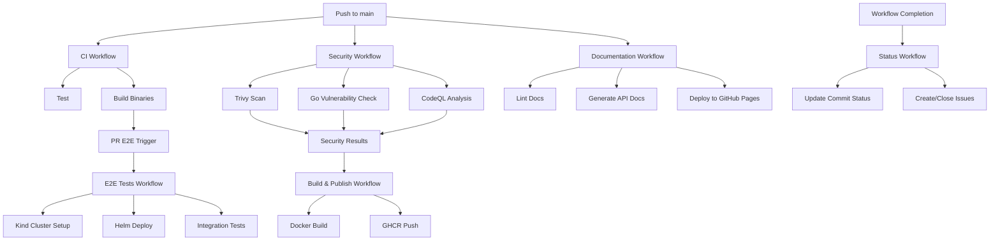

# Pahlevan CI/CD Workflow Architecture

## 🔄 Workflow Dependencies

## 📋 Workflow Details

### 🧪 [CI Workflow](./workflows/ci.yml)
**Triggers:** Push to main/develop, Pull Requests
- **Test Job:** Unit tests, integration tests, eBPF binding generation
- **Build Job:** Binary compilation and artifact upload
- **E2E Trigger:** Dispatches E2E tests for pull requests

**Dependencies:** None (runs independently)

### 🛡️ [Security Workflow](./workflows/security.yml)
**Triggers:** Push to main/develop, Pull Requests, Scheduled (daily 2 AM)
- **Trivy Scan:** File system security scan with SARIF upload
- **Go Vulnerability Check:** `govulncheck` for Go-specific vulnerabilities
- **CodeQL Analysis:** Static code analysis with security rules

**Dependencies:** None (runs independently)

### 🐳 [Build & Publish Workflow](./workflows/build.yml)
**Triggers:** Push to main, Tags, Security workflow completion
- **Docker Build:** Multi-platform container image build (linux/amd64, linux/arm64)
- **GHCR Push:** Publish to GitHub Container Registry
- **Metadata Generation:** Proper tagging and labeling

**Dependencies:** Security workflow must succeed (for workflow_run events)

### 🔬 [E2E Tests Workflow](./workflows/e2e.yml)
**Triggers:** Push to main, Pull Requests, Repository dispatch, Manual
- **Kubernetes Setup:** Kind cluster with kubectl v1.29.0
- **Helm Deployment:** Full operator installation using Helm chart
- **Integration Testing:** Real cluster testing with Go test suite
- **CLI Testing:** Command-line interface validation

**Dependencies:** Triggered by CI workflow for PRs

### 📚 [Documentation Workflow](./workflows/docs.yml)
**Triggers:** Push to main, Pull Requests (docs changes)
- **Markdown Linting:** Documentation quality checks
- **API Generation:** CRD and Go package documentation
- **GitHub Pages:** Automated deployment to documentation site

**Dependencies:** None (runs independently)

### 📊 [Status Workflow](./workflows/status.yml)
**Triggers:** Completion of any other workflow
- **Status Updates:** Commit status badges and checks
- **Issue Management:** Auto-create issues on main branch failures
- **Notifications:** Automated failure reporting

**Dependencies:** Monitors all other workflows

## 🎯 Workflow Flow for Different Events

### On Pull Request:
1. **CI** runs tests and builds binaries
2. **Security** scans for vulnerabilities
3. **E2E Tests** triggered after CI success
4. **Documentation** builds if docs changed
5. **Status** updates commit status for all

### On Push to Main:
1. **CI** validates the code
2. **Security** performs comprehensive scanning
3. **Build & Publish** creates and publishes Docker images (after security passes)
4. **Documentation** deploys to GitHub Pages
5. **Status** manages success/failure notifications

### On Schedule (Daily):
1. **Security** runs vulnerability checks for latest threats

### On Tag Push:
1. **Build & Publish** creates release artifacts with version tags

## 🔧 Configuration Files

| File | Purpose |
|------|---------|
| `.github/workflows/ci.yml` | Core CI pipeline |
| `.github/workflows/security.yml` | Security scanning suite |
| `.github/workflows/build.yml` | Container build and publish |
| `.github/workflows/e2e.yml` | End-to-end testing |
| `.github/workflows/docs.yml` | Documentation pipeline |
| `.github/workflows/status.yml` | Workflow orchestration |

## 🎨 Status Badges

The README includes comprehensive status badges for all workflows:
- Real-time status visibility
- Links to workflow runs
- Coverage of all pipeline stages

## 🚨 Error Handling

- **Automatic issue creation** for main branch failures
- **Comprehensive debugging info** collection on E2E failures
- **Graceful degradation** for non-critical failures
- **Status notifications** for all workflow states