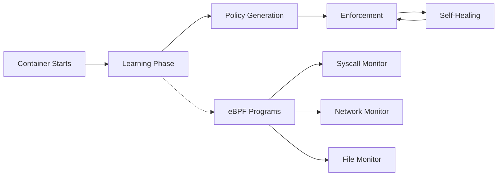

# Pahlevan - eBPF-based Kubernetes Security Operator

[](https://goreportcard.com/report/github.com/obsernetics/pahlevan)
[](https://opensource.org/licenses/Apache-2.0)
[](https://github.com/obsernetics/pahlevan/actions/workflows/ci.yml)
[](https://github.com/obsernetics/pahlevan/actions/workflows/security.yml)
[](https://codecov.io/gh/obsernetics/pahlevan)
[](https://hub.docker.com/r/obsernetics/pahlevan)
[](https://github.com/obsernetics/pahlevan/releases/latest)

> *In Persian tradition, a pahlevan is more than a warrior — it's a guardian of the people, a champion who protects with skill, discipline, and foresight.*

**Pahlevan** is a next-generation Kubernetes security operator that leverages eBPF to provide **proactive attack surface minimization** through adaptive learning, real-time enforcement, and comprehensive monitoring of container behavior.

## Quick Start

### One-Line Installation

```bash
# Install everything with one command
kubectl apply -f https://github.com/obsernetics/pahlevan/releases/latest/download/install.yaml

# Verify installation
kubectl get pods -n pahlevan-system
```

### Create Your First Policy

```yaml
# Save as nginx-policy.yaml
apiVersion: policy.pahlevan.io/v1alpha1
kind: PahlevanPolicy
metadata:
  name: nginx-security
  namespace: default
spec:
  selector:
    matchLabels:
      app: nginx
  learning:
    enabled: true
    duration: 5m
    autoTransition: true
  enforcement:
    mode: "monitor"  # Start with monitoring
    blockUnknown: false
  selfHealing:
    enabled: true
    rollbackThreshold: 5
```

```bash
# Apply the policy
kubectl apply -f nginx-policy.yaml

# Deploy a test nginx
kubectl create deployment nginx --image=nginx:latest
kubectl label deployment nginx app=nginx

# Monitor progress
kubectl get pahlevanpolicy nginx-security -w
```

### Monitor Results

```bash
# Check policy status
kubectl describe pahlevanpolicy nginx-security

# View operator logs
kubectl logs -n pahlevan-system deployment/pahlevan-operator -f

# See learned behaviors (after 5 minutes)
kubectl get pahlevanpolicy nginx-security -o yaml
```

## Key Features

### **Proactive Prevention**
- **Unlike Falco/Tetragon**: Blocks unknown behavior *before* it executes
- **eBPF-powered**: Enforcement at kernel level with microsecond latency
- **Zero-touch**: Automatically learns and adapts to your workloads

### **Adaptive Learning**
- Profiles syscalls, network, and file access during configurable windows
- Auto-generates minimal baseline policies
- Lifecycle-aware tightening (init → steady-state → production)

### **Self-Healing**
- Automatic rollback on policy failures
- Intelligent anomaly detection
- Developer-friendly with fast iteration

### **Rich Observability**
- Real-time attack surface visualization
- Prometheus metrics & OpenTelemetry traces
- Grafana dashboards included

## Installation Methods

### Method 1: Quick Install (Recommended)
```bash
kubectl apply -f https://github.com/obsernetics/pahlevan/releases/latest/download/install.yaml
```

### Method 2: Helm Chart
```bash
helm repo add pahlevan https://obsernetics.github.io/pahlevan-charts
helm install pahlevan pahlevan/pahlevan-operator --namespace pahlevan-system --create-namespace
```

### Method 3: From Source
```bash
git clone https://github.com/obsernetics/pahlevan.git
cd pahlevan
make quick-start  # Builds and deploys everything
```

## Use Cases

| Environment | Policy Mode | Benefits |
|-------------|-------------|----------|
| **Development** | `monitor` | Full observability, no blocking |
| **Staging** | `monitor` + alerts | Catch issues before production |
| **Production** | `enforce` + self-healing | Zero-compromise security |
| **Compliance** | `enforce` + reporting | PCI, HIPAA, SOC2 ready |

## How It Works



1. **Learning**: eBPF programs profile container behavior (syscalls, network, files)
2. **Policy Generation**: Minimal baseline policies auto-generated
3. **Enforcement**: Unknown behavior blocked at kernel level
4. **Self-Healing**: Failed policies automatically rolled back

## Configuration Examples

### Development Environment
```yaml
apiVersion: policy.pahlevan.io/v1alpha1
kind: PahlevanPolicy
metadata:
  name: dev-policy
spec:
  selector:
    matchLabels:
      env: development
  learning:
    duration: 10m
    autoTransition: false  # Manual control
  enforcement:
    mode: "monitor"
    alertOnly: true
```

### Production Environment
```yaml
apiVersion: policy.pahlevan.io/v1alpha1
kind: PahlevanPolicy
metadata:
  name: prod-policy
spec:
  selector:
    matchLabels:
      env: production
  learning:
    duration: 2m
    minSamples: 100
  enforcement:
    mode: "enforce"
    blockUnknown: true
    syscalls:
      defaultAction: "deny"
      allowedSyscalls: ["read", "write", "open", "close"]
      deniedSyscalls: ["ptrace", "process_vm_readv"]
    network:
      allowedEgressPorts: [80, 443, 5432]
      allowedIngressPorts: [8080]
  selfHealing:
    enabled: true
    rollbackThreshold: 3
```

## Monitoring & Observability

### Key Metrics
```promql
# Policy violations rate
rate(pahlevan_policy_violations_total[5m])

# Enforcement actions
rate(pahlevan_enforcement_actions_total[5m])

# Learning progress
pahlevan_learning_progress_ratio

# Attack surface risk
pahlevan_attack_surface_risk_score
```

### Grafana Dashboard
```bash
# Import included dashboard
kubectl apply -f examples/monitoring/grafana-dashboard.yaml
```

### Datadog Integration
```yaml
spec:
  observability:
    metrics:
      exporters:
      - type: datadog
        apiKey: "${DD_API_KEY}"
```

## Prerequisites & System Requirements

### Minimum Requirements
- **Kubernetes**: 1.24+
- **Linux Kernel**: 4.18+ with eBPF support
- **Memory**: 256MB per operator instance
- **CPU**: 100m per operator instance

### Recommended for Production
- **Linux Kernel**: 5.8+ (full eBPF feature support)
- **Memory**: 512MB per operator instance
- **CPU**: 500m per operator instance
- **TC Support**: iproute2 package for network policies

### Check System Compatibility
```bash
# Verify eBPF support
kubectl run pahlevan-check --rm -i --tty \
  --image=obsernetics/pahlevan:latest \
  --command -- /pahlevan debug system-capabilities
```

## Troubleshooting

### Common Issues

#### eBPF Not Loading
```bash
# Check system capabilities
pahlevan debug system-capabilities

# Expected: eBPF=true, TC=true, Tracepoints=true
```

#### High CPU Usage
```bash
# Check event rates
kubectl logs -n pahlevan-system deployment/pahlevan-operator | grep "events/sec"

# Tune if needed
kubectl patch configmap pahlevan-config -p '{"data":{"ring-buffer-size":"32768"}}'
```

#### Policy Not Enforcing
```bash
# Verify target pods
kubectl get pods -l app=myapp --show-labels

# Check learning completion
kubectl get pahlevanpolicy mypolicy -o yaml | grep learningComplete
```

## Documentation

- **[Complete Usage Guide](docs/USAGE.md)** - Comprehensive setup and configuration
- **[Architecture Guide](docs/architecture.md)** - Deep dive into components
- **[Policy Reference](docs/policy-reference.md)** - Complete policy syntax
- **[Troubleshooting](docs/troubleshooting.md)** - Common issues and solutions

## Contributing

```bash
# Development setup
git clone https://github.com/obsernetics/pahlevan.git
cd pahlevan
make dev-cluster  # Creates Kind cluster
make dev-deploy   # Builds and deploys
make test-all     # Runs comprehensive tests
```

## Advanced Topics

### The "zz" Files Explained
You may notice files like `zz_generated.deepcopy.go` in the codebase:
- **Purpose**: Generated code files that appear last alphabetically
- **Generated by**: `controller-gen` tool for Kubernetes API types
- **Important**: Never edit manually - they're auto-regenerated

### Performance Impact
| Component | CPU Overhead | Memory | Network Impact |
|-----------|--------------|---------|----------------|
| Syscall Monitoring | <1% | ~10MB/container | None |
| Network Monitoring | <2% | ~5MB/container | <1% latency |
| File Monitoring | <1% | ~5MB/container | None |
| **Total** | **<4%** | **~20MB/container** | **<1%** |

### Security Considerations
- Operator requires `CAP_BPF` and `CAP_SYS_ADMIN` for eBPF operations
- All eBPF programs verified by kernel verifier
- Resource limits prevent DoS attacks
- Runs with minimal privileges (`runAsNonRoot: true`)

## Community

- Documentation**: [docs/USAGE.md](docs/USAGE.md)

## License

Licensed under the [Apache License 2.0](LICENSE).

## Acknowledgments

- [Cilium](https://cilium.io/) for eBPF libraries and inspiration
- [Falco](https://falco.org/) for runtime security pioneering
- [Tetragon](https://tetragon.io/) for eBPF-based observability
- [Kubernetes SIGs](https://github.com/kubernetes-sigs) for operator frameworks

---

** Ready to minimize your attack surface?**

Star ⭐ this repository and get started in under 5 minutes!

```bash
kubectl apply -f https://github.com/obsernetics/pahlevan/releases/latest/download/install.yaml
```