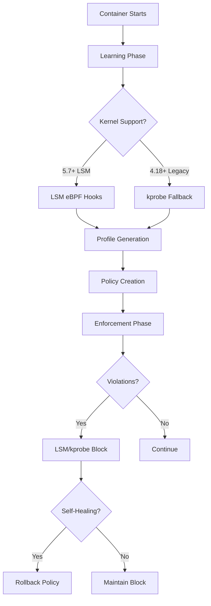

# Pahlevan

## eBPF Kubernetes Security Operator

[](https://goreportcard.com/report/github.com/obsernetics/pahlevan)
[](https://opensource.org/licenses/Apache-2.0)

## 🚀 Workflow Status

| Workflow | Status | Description |
|----------|--------|-------------|
| CI | [](https://github.com/obsernetics/pahlevan/actions/workflows/ci.yml) | Core build, test, and integration |
| Security | [](https://github.com/obsernetics/pahlevan/actions/workflows/security.yml) | Security scanning, CodeQL, vulnerabilities |
| Build & Publish | [](https://github.com/obsernetics/pahlevan/actions/workflows/build.yml) | Docker build and GHCR publishing |
| E2E Tests | [](https://github.com/obsernetics/pahlevan/actions/workflows/e2e.yml) | End-to-end testing in real K8s cluster |
| Documentation | [](https://github.com/obsernetics/pahlevan/actions/workflows/docs.yml) | Documentation building and deployment |

📊 **Container Registry:** [`ghcr.io/obsernetics/pahlevan`](https://github.com/obsernetics/pahlevan/pkgs/container/pahlevan)
📚 **Documentation:** [GitHub Pages](https://obsernetics.github.io/pahlevan/)

**Pahlevan** is a Kubernetes security operator that provides **runtime security monitoring and enforcement** through eBPF-powered workload profiling and policy-based protection.

## Key Features

### **eBPF-Powered Monitoring**
Real-time syscall, network, and file access monitoring at kernel level with Linux Security Module (LSM) and kprobe support

### **Adaptive Learning**
Automatically profiles workload behavior and generates security policies

### **Policy-Based Enforcement**
Configurable security policies with monitoring and blocking modes

### **Self-Healing**
Automatic policy rollback when enforcement causes issues

### **Kubernetes-Native**
Full integration with Kubernetes APIs, RBAC, and operator patterns

### **Rich Observability**
Prometheus metrics, OpenTelemetry tracing, and attack surface analysis

## Quick Start

### 1. Install Pahlevan
```bash
kubectl apply -f https://github.com/obsernetics/pahlevan/releases/latest/download/install.yaml
```

### 2. Create a Security Policy
```yaml
apiVersion: policy.pahlevan.io/v1alpha1
kind: PahlevanPolicy
metadata:
  name: nginx-security
  namespace: default
spec:
  selector:
    matchLabels:
      app: nginx
  learning:
    enabled: true
    duration: 5m
    autoTransition: true
  enforcement:
    mode: "monitor"
    blockUnknown: false
  selfHealing:
    enabled: true
```

### 3. Deploy and Monitor
```bash
# Deploy and label a workload
kubectl create deployment nginx --image=nginx:latest
kubectl label deployment nginx app=nginx

# Apply the policy
kubectl apply -f policy.yaml

# Monitor progress
kubectl get pahlevanpolicy nginx-security -w
```

## How It Works



### Process Flow

1. **Learning Phase**: eBPF programs (LSM hooks on kernel 5.7+ or kprobe fallbacks) monitor and profile container behavior
2. **Policy Generation**: Security policies are automatically generated based on observed syscalls, network connections, file access, and process execution
3. **Enforcement**: Policies can monitor or block unwanted behavior at the Linux Security Module layer or via kprobes
4. **Self-Healing**: When policies cause issues, they can be automatically rolled back to maintain availability

### LSM vs Kprobe Monitoring

| Method | Kernel Version | Performance | Security Level | Features |
|--------|----------------|-------------|----------------|----------|
| **LSM eBPF** | 5.7+ | Higher | Native kernel security | Process, file, network, capability monitoring |
| **kprobe** | 4.18+ | Lower | Function hooking | Syscall and VFS-level monitoring |

## System Requirements

| Component | Minimum | Recommended |
|-----------|---------|-------------|
| **Kubernetes** | 1.24+ | 1.28+ |
| **Linux Kernel** | 4.18+ with eBPF | 5.7+ with LSM BPF |
| **Memory** | 256MB | 512MB |
| **CPU** | 100m | 500m |

### Kernel Feature Support

| Feature | Kernel Version | Benefits |
|---------|----------------|----------|
| **eBPF Basic** | 4.18+ | Syscall and network monitoring |
| **LSM BPF** | 5.7+ | Enhanced security monitoring with lower overhead |
| **kprobe** | 3.15+ | Fallback monitoring for older kernels |

## Installation Methods

### Helm Chart (Recommended)
```bash
helm repo add pahlevan https://obsernetics.github.io/pahlevan-charts
helm install pahlevan pahlevan/pahlevan-operator \
  --namespace pahlevan-system \
  --create-namespace
```

### From Source
```bash
git clone https://github.com/obsernetics/pahlevan.git
cd pahlevan
make quick-start
```

### Direct Apply
```bash
kubectl apply -f https://github.com/obsernetics/pahlevan/releases/latest/download/install.yaml
```

## Documentation

| Document | Description |
|----------|-------------|
| **[Quick Start Guide](docs/quick-start.md)** | Get running in 5 minutes |
| **[Architecture Overview](docs/architecture.md)** | System design and components |
| **[Policy Reference](docs/policy-reference.md)** | Complete policy syntax |
| **[Deployment Guide](docs/deployment.md)** | Production deployment patterns |
| **[Troubleshooting](docs/troubleshooting.md)** | Common issues and solutions |
| **[API Reference](docs/api-reference.md)** | Complete API documentation |

## Use Cases

| Environment | Mode | Description | Benefits |
|-------------|------|-------------|----------|
| **Development** | `monitor` | Full observability without blocking | Zero friction development |
| **Staging** | `monitor` + `alerts` | Catch issues before production | Early risk detection |
| **Production** | `enforce` | Zero-compromise security with self-healing | Maximum protection |
| **Compliance** | `enforce` + `reporting` | PCI, HIPAA, SOC2 ready | Audit-ready security |

## Performance Impact

| Metric | Impact | Details |
|--------|--------|---------|
| **CPU Overhead** | < 5% | Low overhead eBPF programs |
| **Memory Usage** | 20-50MB | Per monitored container |
| **Network Latency** | < 1ms | Minimal eBPF monitoring overhead |
| **Application Changes** | **Zero** | No code modifications required |

> **Note**: Performance characteristics depend on workload patterns and policy complexity. Monitoring mode has lower overhead than enforcement mode.

---

## License

Licensed under the [Apache License 2.0](LICENSE).
