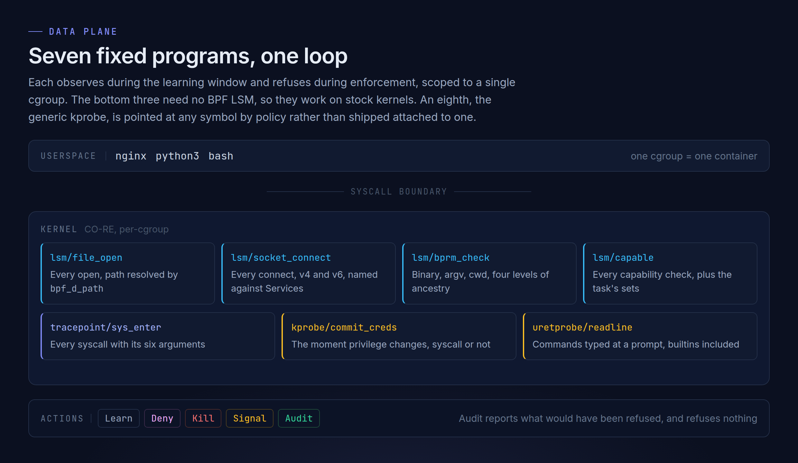

<div align="center">

<h1>Pahlevan</h1>

<p><b>Your workload writes its own security policy. The kernel enforces it.</b></p>

<p>
  <a href="https://github.com/obsernetics/pahlevan/actions/workflows/ci.yml"></a> <a href="https://goreportcard.com/report/github.com/obsernetics/pahlevan"></a> <a href="https://opensource.org/licenses/Apache-2.0"></a> <a href="https://go.dev/"></a> <a href="https://github.com/obsernetics/pahlevan/releases"></a> <a href="https://github.com/obsernetics/pahlevan/stargazers"></a>
  <br/>
     <a href="#contributing"></a>
</p>


</div>

## The idea

A container runs one program, opens the same files every time, dials the same
handful of destinations, and uses maybe sixty of the kernel's four hundred
syscalls. Pahlevan watches it do that, once, then refuses everything else in
the kernel at the moment of the attempt, with `EPERM`. Nobody writes a rule. An
attacker inherits that baseline rather than root: a command-injection bug in a
Python service gets them `python3` and not `/etc/shadow`, an unlearned egress,
a binary dropped in `/tmp`, or `CAP_SYS_ADMIN`. The baseline cannot go stale,
because it describes the image that is running, and a denial is a fact rather
than a score: the kernel found the path in a hash map, or it did not.

<p align="center">
  
</p>

## Watch it happen: `pahlevan ui`

An interactive console over the agent's gRPC stream (`--grpc`, default
`localhost:9090`). A bare `pahlevan` in a terminal opens the same thing.

```
pahlevan  1  2  3  4  5 events  6  7
╭─ events ─────────────────────────────────────────────────────────────────────────────────────╮
│  TIME      VERDICT  TYPE     PROCESS       WORKLOAD            DETAIL                        │
│  14:22:00  allow    file     nginx         prod/Deployment/n…  read /etc/nginx/nginx.conf    │
│  14:22:01  allow    network  nginx         prod/Deployment/n…  tcp prod/postgres:5432        │
│  14:22:02  allow    process  nginx         prod/Deployment/n…  exec /usr/sbin/nginx          │
│  14:22:03  allow    syscall  nginx         prod/Deployment/n…  syscall openat                │
│  14:22:04  allow    file     python3       prod/Deployment/a…  read /app/config.yaml         │
│  14:22:05  allow    network  python3       prod/Deployment/a…  tcp prod/redis:6379           │
│  14:22:06  ✖ DENY   file     sh            prod/Deployment/n…  read /etc/shadow              │
│  14:22:07  ✖ DENY   process  sh            prod/Deployment/n…  exec /tmp/xmrig               │
│  14:22:08  ✖ DENY   network  xmrig         prod/Deployment/n…  tcp 45.9.1.4:80               │
│  14:22:09  ✖ DENY   capabi…  sh            prod/Deployment/n…  capability CAP_SYS_ADMIN      │
╰──────────────────────────────────────────────────────────────────────────────────────────────╯
10 events · 4 denied · node-3:9090 · 0s
```

Seven views on `tab` and the number keys, named in full when the terminal is
wide enough: overview, policies, profiles, workloads, events, attack surface,
coverage. Workloads counts what each one did against what was refused and opens
a pane putting `OBSERVED` beside `REFUSED`; coverage is the ATT&CK table read
from `pkg/coverage` rather than retyped. `j`/`k` move, `enter` opens a row,
`space` pauses the list while the counters keep running, `/` filters, `q`
quits, and `?` lists every key, generated from the bindings themselves.

- **It is a reader.** It never changes a policy, a mode or a profile, so it
  cannot be the thing that turns enforcement off during an incident.
- **It does not break scripts.** Every other command keeps its exact output,
  and with no terminal - piped, redirected, under `CI`, `NO_COLOR`,
  `TERM=dumb` or `--no-tui` - it prints a plain greppable summary.
- **A bug in it needs no cluster.** `pahlevan ui --replay events.jsonl` reads
  the JSON-lines the file sink writes, so a capture reproduces the problem.

## What it watches

Seven eBPF programs, all CO-RE, all scoped to a single cgroup so nothing leaks
across containers or reaches the rest of the node.

<p align="center">
  
</p>

| Program | Sees | Does |
|---|---|---|
| `lsm/file_open` | Every open, path resolved in-kernel by `bpf_d_path` | Refuses an unlearned path |
| `lsm/socket_connect` | Every connect, IPv4 and IPv6, named against cluster Services | Refuses an unlearned destination |
| `lsm/bprm_check_security` | Every exec: binary, argv, cwd, four levels of ancestry | Refuses an unlearned binary, or one its parent may not launch |
| `lsm/capable` | Every capability check, plus the task's capability sets | Refuses a capability never exercised |
| `kprobe/commit_creds` | Privilege actually changing, with no `execve` to explain it | Reports it; kills the task if you ask it to |
| `tracepoint/raw_syscalls/sys_enter` | Every syscall, with its six arguments | Becomes the generated seccomp profile |
| `uretprobe/readline` | Shell builtins like `history -c`, which produce no exec | Records what somebody with a shell actually did |

"Refuses" is five choices per workload: **Deny** (`EPERM`, or an errno you
name), **Kill**, **Signal** (`SIGSTOP` keeps the memory `SIGKILL` destroys),
**Audit** (report and allow), or **Learn**. Roll out with Audit: unlike
learning, it does not widen the baseline as it goes. An eighth program, a
generic kprobe, is pointed at any kernel function a policy names with no
rebuild, and cannot deny, because a kprobe fires alongside a function rather
than in place of it. Detail: [`docs/architecture.md`](docs/architecture.md).

## The trade, stated plainly

A baseline narrow enough to stop an attacker is narrow enough to stop you. If
you `kubectl exec` into a production pod and run `curl`, Pahlevan denies it: it
cannot tell your hands from someone else's. That is the mechanism working
correctly, and every honest evaluation starts there. Three things exist because
of it - `Monitoring` mode, which learns and reports without ever denying;
self-healing, which returns a container to learning if enforcement breaks it;
and policy exceptions, which widen the set deliberately and in writing.

## Architecture

<p align="center">
  
</p>

A per-node **agent** DaemonSet owns the eBPF data plane and enforces locally in
the kernel. A leader-elected **operator** Deployment drives the policy
lifecycle, status aggregation and CEL admission, with no host access and no
mutating webhook; if it is down, enforcement already in the kernel keeps
working. Events leave the agent as JSON lines, an HTTP webhook, OTLP logs or a
gRPC stream, behind a bounded queue that drops and counts rather than stalling
the ring-buffer readers; denials can also reach Slack, PagerDuty or a template.

## Quick start

```bash
kubectl apply -f https://github.com/obsernetics/pahlevan/releases/latest/download/install.yaml
# or: helm repo add pahlevan https://obsernetics.github.io/pahlevan/charts
```

```yaml
apiVersion: policy.pahlevan.io/v1beta1
kind: PahlevanPolicy
metadata: {name: nginx-security}
spec:
  selector: {matchLabels: {app: nginx}}
  learningConfig: {duration: 5m, autoTransition: true}   # watch, then enforce
  enforcementConfig: {mode: Monitoring}   # Blocking denies in-kernel; start here
  selfHealing: {enabled: true}   # back to learning if enforcement breaks it
```

Before switching to `Blocking`, run `pahlevan policy explain -f policy.yaml`:
no cluster needed, and it says which fields translate into kernel state and
which are ignored, including the ones that look like they work. `pahlevan
profile` shows what was learned, `pahlevan debug` whether this kernel can
enforce at all. Every command and flag:
[`docs/quick-start.md`](docs/quick-start.md),
[`docs/policy-reference.md`](docs/policy-reference.md), [`examples/`](examples).

## Requirements

| | |
|---|---|
| Kubernetes | 1.24+; user namespaces and CEL admission need 1.30+ |
| Linux | 5.8+ to observe: CO-RE, ring buffer, `CAP_BPF` |
| In-kernel enforcement | `CONFIG_BPF_LSM` with `lsm=bpf` on the kernel command line |
| Building from source | Go 1.26+; the published image needs nothing |
| Without the BPF LSM | The LSM hooks do not attach and Pahlevan is an observability tool; the `commit_creds` kprobe and the syscall tracepoint still work, because kprobes need no boot parameter |

See [`docs/system-requirements.md`](docs/system-requirements.md),
[`docs/lsm-support.md`](docs/lsm-support.md), and
[`docs/packages.md`](docs/packages.md) for the image and chart.

## Development

`make build`, `make test`, `make lint` and `make ebpf-build` do what they say,
and `make help` lists the rest. eBPF is never loaded on a developer machine:
`hack/vm/up.sh` brings up a kernel with the BPF LSM active and `make vm-test`
runs there, which any change to `bpf/*.c`, the loader or a map layout needs,
because the verifier accepts or rejects a program at attach time and a change
that passes `go build` can still fail to load.

Every published number comes from
[`test/benchmark/run.sh`](test/benchmark/run.sh), run in that VM twice, once
with no agent and once with Pahlevan enforcing, because a scenario that
silently failed to run is otherwise indistinguishable from one that was
prevented ([`docs/benchmarks/`](docs/benchmarks)).

## Honest status

One maintainer, no public production adopters yet, and an API still moving:
`v1alpha1` is deprecated in favour of `v1beta1`. The learning model has a
conceptual limit no engineering removes - a workload already compromised when
learning begins gets its malicious behaviour baselined with everything else.
[`ROADMAP.md`](ROADMAP.md) marks what exists, what is in progress and what is
merely planned. Nothing here describes something that is not in the tree.

## Contributing

Open an issue for substantial changes, run `make test lint` before submitting,
and keep eBPF changes verifiable with `make vm-test`. See
[`CONTRIBUTING.md`](CONTRIBUTING.md). Licensed under the
[Apache License 2.0](LICENSE).
