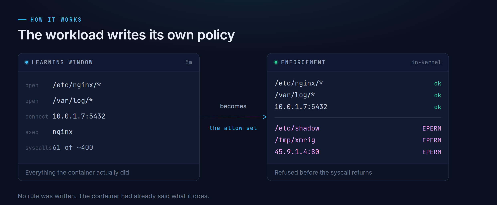

<div align="center">

<h1>Pahlevan</h1>

<p><b>Your workload writes its own security policy. The kernel enforces it.</b></p>

<p>
  <a href="https://github.com/obsernetics/pahlevan/actions/workflows/ci.yml"></a> <a href="https://goreportcard.com/report/github.com/obsernetics/pahlevan"></a> <a href="https://opensource.org/licenses/Apache-2.0"></a> <a href="https://go.dev/"></a> <a href="https://github.com/obsernetics/pahlevan/releases"></a> <a href="https://github.com/obsernetics/pahlevan/stargazers"></a>
  <br/>
     <a href="#contributing"></a>
</p>


</div>

## The idea

A container runs one program, opens the same files, dials the same few
destinations and uses about sixty of the kernel's four hundred syscalls.
Pahlevan watches it do that once, then refuses everything else in the kernel
with `EPERM`. Nobody writes a rule, and an attacker inherits the baseline
instead of root.

<p align="center">
  
</p>

## The console

Run `pahlevan` to see policies, workloads, live events and ATT&CK coverage in
one place. It only reads, so it cannot turn enforcement off.

## The trade

A baseline narrow enough to stop an attacker is narrow enough to stop you:
`kubectl exec` into a pod and run `curl`, and it is denied. Start in
`Monitoring`, which reports without denying, and use self-healing and policy
exceptions to widen the set deliberately.

## Architecture

<p align="center">
  
</p>

A per-node **agent** enforces in the kernel. A leader-elected **operator**
drives the policy lifecycle with no host access; if it is down, enforcement
keeps working.

## Quick start

```bash
kubectl apply -f https://github.com/obsernetics/pahlevan/releases/latest/download/install.yaml
```

```yaml
apiVersion: policy.pahlevan.io/v1beta1
kind: PahlevanPolicy
metadata: {name: nginx}
spec:
  selector: {matchLabels: {app: nginx}}
  learningConfig: {duration: 5m, autoTransition: true}
  enforcementConfig: {mode: Monitoring}   # Blocking denies in-kernel
```

`pahlevan policy explain -f policy.yaml` shows what a policy will enforce, with
no cluster. More in [`docs/quick-start.md`](docs/quick-start.md).

## Requirements

| | |
|---|---|
| Kubernetes | 1.24+ |
| Linux | 5.8+ to observe |
| Enforcement | `lsm=bpf` on the kernel command line |

Without the BPF LSM, Pahlevan observes but cannot refuse. See
[`docs/system-requirements.md`](docs/system-requirements.md).

## Status

One maintainer, no public production adopters yet. A workload already
compromised when learning starts has that behaviour baselined too.
[`ROADMAP.md`](ROADMAP.md) says what exists and what does not.

## Contributing

Run `make test lint`. eBPF changes must pass `make vm-test`, which loads the
programs in a VM, never on your machine. See
[`CONTRIBUTING.md`](CONTRIBUTING.md). Apache 2.0.
