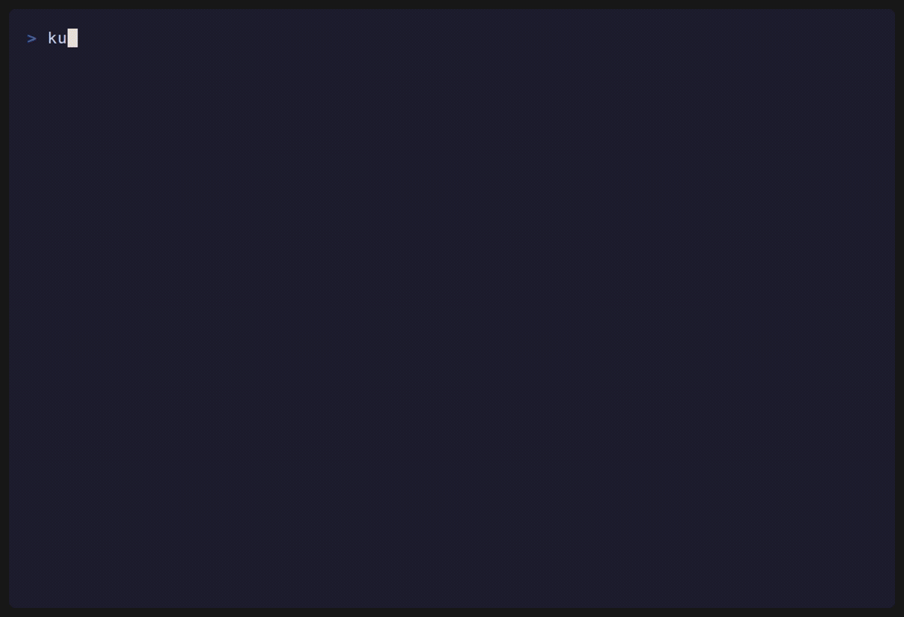
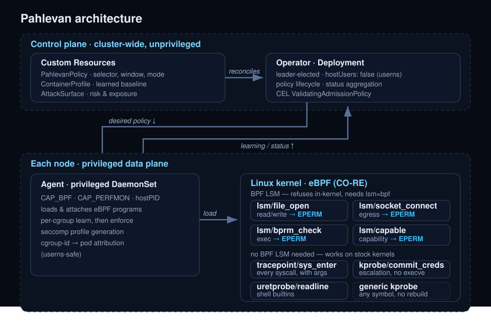

<div align="center">

<h1>Pahlevan</h1>

<p><b>eBPF-powered runtime security for Kubernetes.</b><br/>
Self-learning workload baselines, enforced <i>in-kernel</i> - no hand-written rules.</p>

<p>
  <a href="https://github.com/obsernetics/pahlevan/actions/workflows/ci.yml"></a>
  <a href="https://goreportcard.com/report/github.com/obsernetics/pahlevan"></a>
  <a href="https://opensource.org/licenses/Apache-2.0"></a>
  <a href="https://go.dev/"></a>
  <a href="https://github.com/obsernetics/pahlevan/releases"></a>
  <a href="https://github.com/obsernetics/pahlevan/stargazers"></a>
  <br/>
  
  
  
  <a href="#contributing"></a>
</p>



</div>

## Why Pahlevan

Most runtime tools either *watch* (alert-only) or make you *write the rules yourself*.
Pahlevan learns what a workload does, then blocks the rest in-kernel.

- **Auto-learning, not manual rules.** Files opened, destinations dialed, and binaries executed during a learning window become a per-cgroup allow-set.
- **Real in-kernel enforcement.** LSM BPF hooks deny unlearned opens, egress, and execs with `EPERM`. The syscall never succeeds.
- **Accurate attribution.** Events tie to the container via `bpf_get_current_cgroup_id()`; paths resolve in-kernel with `bpf_d_path()`.
- **Kubernetes-native and self-healing.** Three CRDs drive the lifecycle, a seccomp profile is generated from the learned syscalls, and enforcement rolls back automatically if it disrupts the workload.

| | **Pahlevan** | Falco | Tetragon | Cilium |
| --- | --- | --- | --- | --- |
| Learns behavior | **Auto (per-cgroup)** | Manual rules | Manual `TracingPolicy` | Static policy |
| Blocks in-kernel | **Files, egress, exec** | Alert only | Possible, hand-written | Network only |
| Rules to author | **None (learned)** | Many | Per-policy | Network rules |
| Coverage | Syscalls, files, egress, exec | Runtime events | Kernel tracing | L3-L7 traffic |

Falco and Tetragon are excellent observability tools. Pahlevan's claim is closing the
loop: learn the baseline, then *prevent* the deviation.

## Architecture

<p align="center">
  
</p>

A per-node **agent** DaemonSet owns the eBPF data plane and enforces locally in the kernel.
A leader-elected **operator** Deployment drives policy lifecycle, status aggregation, and CEL
admission, with no host access and no webhook. Detail: [`docs/architecture.md`](docs/architecture.md).

## Quick Start

Install the CRDs, RBAC, the operator, and the node agents:

```bash
kubectl apply -f https://github.com/obsernetics/pahlevan/releases/latest/download/install.yaml
```

Apply an adaptive policy to any labelled workload:

```yaml
apiVersion: policy.pahlevan.io/v1alpha1
kind: PahlevanPolicy
metadata:
  name: nginx-security
spec:
  selector:
    matchLabels:
      app: nginx
  learningConfig:
    duration: 5m          # observe normal behavior
    autoTransition: true  # then enforce automatically
  enforcementConfig:
    mode: Monitoring      # use Blocking to deny in-kernel
  selfHealing:
    enabled: true         # roll back if enforcement breaks the workload
```

Then watch it learn and transition to enforcement:

```bash
kubectl get pahlevanpolicy nginx-security -w
```

Flip the mode to `Blocking` once you trust the baseline. More in [`examples/`](examples).

## Benchmarks

Measured head-to-head against Falco and Tetragon in a kernel-isolated k3s VM: one
tool at a time, same `nginx:1.27` workload, same four attack scenarios, defaults.

| | **Pahlevan** | Falco | Tetragon |
| --- | :---: | :---: | :---: |
| Attacks blocked | **4 / 4** (in-kernel `EPERM`) | 0 / 4 (alert-only) | 0 / 4 (no blocking by default) |
| Attacks detected | 3 / 4 | 2 / 4 (default rules) | 4 / 4 (exec telemetry) |

Tetragon can block with a hand-written `TracingPolicy`, but an unscoped node-wide kill policy
froze process creation on the node. Methodology, environment, resource measurements, and honest
caveats: [`docs/benchmarks/results.md`](docs/benchmarks/results.md). Every number comes from
`test/benchmark/run.sh`.

## Requirements

- **Kubernetes 1.24+** (the user-namespace operator needs 1.30+).
- **Linux 5.8+** for observation (CO-RE, ring buffer, `CAP_BPF`).
- **`CONFIG_BPF_LSM` with `lsm=bpf`** for in-kernel enforcement; monitoring-only mode works without it.

Details: [`docs/system-requirements.md`](docs/system-requirements.md), [`docs/lsm-support.md`](docs/lsm-support.md).

## Install and packages

```bash
helm repo add pahlevan https://obsernetics.github.io/pahlevan/charts
helm install pahlevan pahlevan/pahlevan-operator -n pahlevan-system --create-namespace
```

The distroless image `ghcr.io/obsernetics/pahlevan` ships the agent, operator, and CLI. Tags,
chart usage, and manifest pinning: [`docs/packages.md`](docs/packages.md). Release notes:
[`CHANGELOG.md`](CHANGELOG.md).

## Development

```bash
make build          # agent, operator, and CLI binaries
make test           # unit tests (generated CRDs/manifests, fmt, vet)
make lint           # golangci-lint + yamllint
make ebpf-build     # regenerate CO-RE objects + Go bindings (needs clang)
hack/vm/up.sh       # bring up the eBPF-capable VM, then: make vm-test
```

[`hack/vm/`](hack/vm) provisions a kernel with the BPF LSM enabled for testing the eBPF
programs. `make help` lists every target.

## Contributing

Contributions are welcome. Open an issue for substantial changes, run `make test lint` before
submitting, and keep eBPF changes verifiable with `make vm-test`.

## License

Licensed under the [Apache License 2.0](LICENSE).
