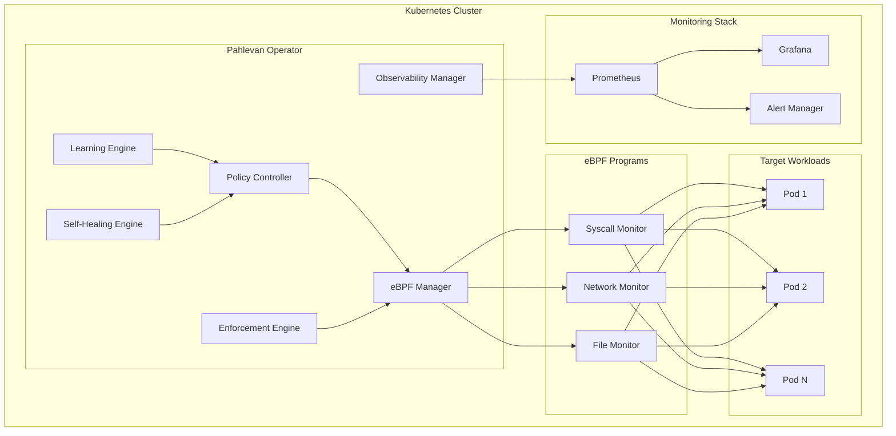
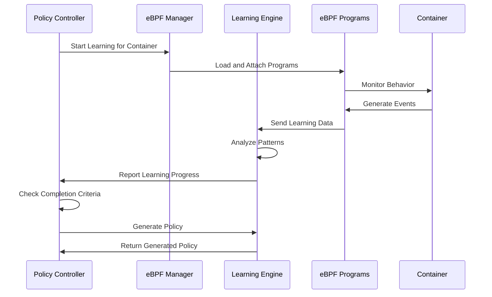
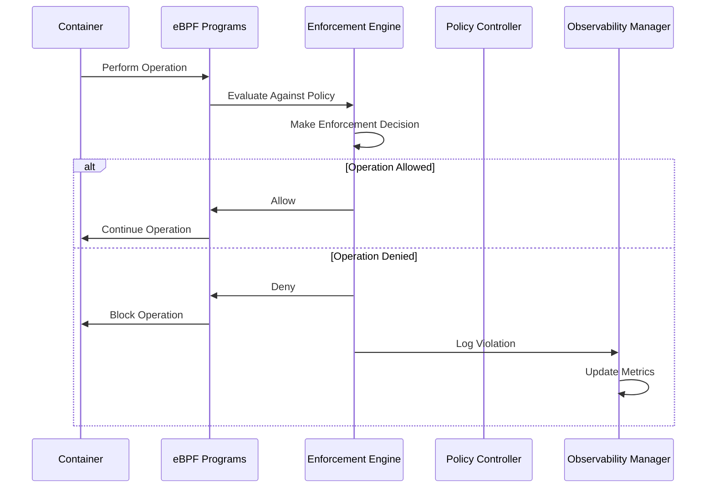
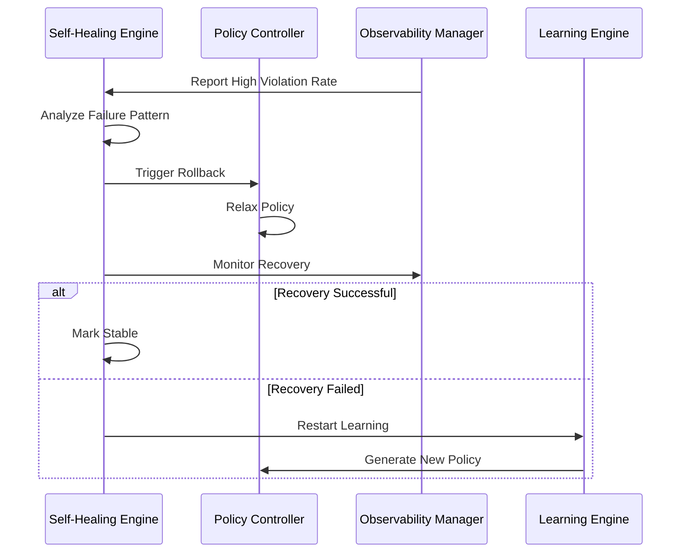

# Architecture Overview

Pahlevan is designed as a cloud-native Kubernetes operator that leverages eBPF for kernel-level security enforcement. This document provides a comprehensive overview of the system architecture, components, and data flow.

## High-Level Architecture



## Core Components

### 1. Policy Controller

The Policy Controller is the central component that manages the lifecycle of Pahlevan policies.

**Responsibilities:**
- Watches for `PahlevanPolicy` custom resources
- Coordinates learning and enforcement phases
- Manages policy transitions and updates
- Handles self-healing operations

**Key Features:**
- Kubernetes controller pattern implementation
- Event-driven architecture
- Graceful error handling and retries
- Comprehensive status reporting

```go
type PolicyController struct {
    client.Client
    scheme          *runtime.Scheme
    ebpfManager     *ebpf.Manager
    learningEngine  *policies.LearningEngine
    enforcementEngine *policies.EnforcementEngine
    selfHealingManager *policies.SelfHealingManager
}
```

### 2. eBPF Manager

The eBPF Manager handles the loading, attachment, and management of eBPF programs with full production-ready implementation.

**Responsibilities:**
- Load and compile eBPF programs with comprehensive error handling
- Attach programs to appropriate kernel hooks (LSM, kprobes, tracepoints)
- Manage eBPF maps for policy data with efficient synchronization
- Handle eBPF program lifecycle and cleanup
- Provide real-time event parsing and processing

**Implementation Status:** ✅ **Fully Implemented**
- Complete eBPF event parsing (parseNetworkEvent, parseFileEvent)
- Container policy management with proper state tracking
- Comprehensive error handling and recovery mechanisms
- Support for both LSM hooks (kernel 5.7+) and kprobe fallbacks
- Handle program lifecycle and updates

**eBPF Programs:**

#### Syscall Monitor (`syscall_monitor.c`)
- Attaches to tracepoints for syscall entry/exit
- Profiles allowed/denied syscalls per container
- Enforces syscall policies in real-time
- Collects usage statistics

#### Network Monitor (`network_monitor.c`)
- Uses TC (Traffic Control) eBPF programs
- Monitors ingress/egress network traffic
- Enforces port-based policies
- Tracks connection patterns

#### File Monitor (`file_monitor.c`)
- Attaches to tracepoint hooks for file operations
- Monitors file access patterns (open, read, write)
- Enforces file access policies
- Tracks file access violations

```c
// Example syscall monitor structure
struct syscall_event {
    __u32 pid;
    __u32 tgid;
    __u32 uid;
    __u64 syscall_nr;
    __u64 timestamp;
    char comm[TASK_COMM_LEN];
    char container_id[CONTAINER_ID_LEN];
};
```

### 3. Learning Engine

The Learning Engine automatically profiles container behavior during the learning phase.

**Responsibilities:**
- Collect behavioral data from eBPF programs
- Analyze patterns and generate baseline profiles
- Create minimal security policies
- Determine optimal transition timing

**Learning Process:**
1. **Data Collection**: Gather syscall, network, and file access data
2. **Pattern Analysis**: Identify common behaviors and outliers
3. **Profile Generation**: Create minimal allow-lists
4. **Validation**: Ensure policies don't break legitimate operations

```go
type BehavioralProfile struct {
    ContainerID    string
    SyscallProfile SyscallProfile
    NetworkProfile NetworkProfile
    FileProfile    FileProfile
    Confidence     float64
    LastUpdated    time.Time
}
```

### 4. Enforcement Engine

The Enforcement Engine evaluates events against policies and takes enforcement actions.

**Responsibilities:**
- Real-time policy evaluation
- Enforcement action execution
- Violation logging and metrics
- Performance optimization

**Enforcement Modes:**
- **Monitor**: Log violations without blocking
- **Enforce**: Block violations and log events
- **Alert**: Send alerts on violations

```go
type EnforcementResult struct {
    Action      ActionType    // Allow, Deny, Alert
    Reason      string
    IsViolation bool
    Confidence  float64
    Metadata    map[string]interface{}
}
```

### 5. Self-Healing Engine

The Self-Healing Engine automatically recovers from policy failures with comprehensive implementation of all healing strategies.

**Implementation Status:** ✅ **Fully Implemented**
- Complete policy rollback verification with violation tracking
- Intelligent policy relaxation based on violation types
- Emergency mode activation for system compromise scenarios
- Health monitoring with component-level status tracking
- Anomaly detection with adaptive thresholds

**Responsibilities:**
- Monitor policy effectiveness
- Detect and diagnose failures
- Implement rollback strategies
- Maintain system availability

**Self-Healing Strategies:**
- **Gradual Rollback**: Step-by-step policy relaxation
- **Emergency Mode**: Disable enforcement during critical failures
- **Learning Reset**: Restart learning phase if needed
- **Intelligent Recovery**: Learn from failures to improve policies

### 6. Observability Manager

The Observability Manager provides comprehensive monitoring and alerting with full production implementation.

**Implementation Status:** ✅ **Fully Implemented**
- Complete metrics collection and export system
- Multi-format alerting with webhook, email, Slack, and PagerDuty support
- Comprehensive logging with structured output
- Real-time performance monitoring

**Components:**
- **Metrics Collection**: Prometheus metrics for all components with custom metric definitions
- **Distributed Tracing**: OpenTelemetry integration with Jaeger support
- **Alerting**: Policy violation and system health alerts with multiple channels
- **Dashboards**: Pre-built Grafana dashboards with attack surface visualization
- **Attack Surface Analysis**: Real-time security posture assessment and visualization

### 7. Attack Surface Analyzer

The Attack Surface Analyzer provides continuous security posture assessment and risk analysis.

**Implementation Status:** ✅ **Fully Implemented**
- Complete attack surface mapping and analysis
- Multi-format export capabilities (Prometheus, JSON, Grafana, OTEL)
- Risk assessment with configurable matrices
- Network topology analysis and vulnerability scanning

**Key Features:**
- Real-time attack surface calculation and scoring
- Exporters for Prometheus, JSON, Grafana dashboards, and OpenTelemetry
- Risk matrix configuration for different security levels
- Integration with observability stack for comprehensive monitoring

## Data Flow

### 1. Learning Phase



### 2. Enforcement Phase



### 3. Self-Healing Process



## Security Model

### Operator Privileges

The Pahlevan operator requires specific privileges to function:

```yaml
# Required capabilities
capabilities:
  add:
  - CAP_BPF          # Load eBPF programs
  - CAP_SYS_ADMIN    # Manage kernel resources
  - CAP_NET_ADMIN    # Network program attachment

# Security context
securityContext:
  runAsNonRoot: true
  runAsUser: 65534
  allowPrivilegeEscalation: false
  readOnlyRootFilesystem: true
  capabilities:
    drop: ["ALL"]
    add: ["CAP_BPF", "CAP_SYS_ADMIN", "CAP_NET_ADMIN"]
```

### eBPF Program Security

- **Kernel Verifier**: All eBPF programs pass through the kernel verifier
- **Resource Limits**: Memory and CPU limits prevent DoS attacks
- **Sandboxing**: Programs run in isolated eBPF virtual machine
- **Program Signing**: Optional program signing for enhanced security

### Policy Isolation

- **Namespace Isolation**: Policies are namespace-scoped
- **RBAC Integration**: Kubernetes RBAC controls policy access
- **Least Privilege**: Minimal required permissions
- **Audit Logging**: All policy changes are logged

## Performance Characteristics

### Resource Usage

| Component | CPU (per container) | Memory (per container) | Network Impact |
|-----------|-------------------|----------------------|----------------|
| Syscall Monitor | ~1-2% | ~10-15MB | None |
| Network Monitor | ~1-3% | ~5-10MB | Minimal |
| File Monitor | ~1-2% | ~5-10MB | None |
| **Total** | **~3-7%** | **~20-35MB** | **Minimal** |

> **Note**: Performance characteristics vary based on workload behavior, policy complexity, and system load. These are estimated ranges based on typical usage patterns.

### Scalability Limits

- **Containers per Node**: Hundreds (limited by kernel eBPF resources)
- **Policies per Cluster**: Thousands (limited by etcd and operator capacity)
- **Events per Second**: Depends on ring buffer configuration and processing capacity
- **Learning Time**: 5-30 minutes (configurable, depends on workload complexity)

### Optimization Techniques

- **Event Batching**: Reduce context switches
- **Ring Buffer Tuning**: Optimize memory usage
- **Program Caching**: Reuse loaded programs
- **Policy Caching**: Cache compiled policies

## Deployment Patterns

### Single-Cluster Deployment

```yaml
apiVersion: apps/v1
kind: Deployment
metadata:
  name: pahlevan-operator
  namespace: pahlevan-system
spec:
  replicas: 1  # Single instance per cluster
  selector:
    matchLabels:
      app: pahlevan-operator
  template:
    spec:
      serviceAccountName: pahlevan-operator
      containers:
      - name: operator
        image: obsernetics/pahlevan:latest
        resources:
          requests:
            memory: "256Mi"
            cpu: "100m"
          limits:
            memory: "512Mi"
            cpu: "500m"
```

### Multi-Cluster Deployment

For multi-cluster setups, deploy Pahlevan in each cluster with centralized monitoring:

```yaml
# Central monitoring cluster
apiVersion: v1
kind: ConfigMap
metadata:
  name: prometheus-config
data:
  prometheus.yml: |
    global:
      scrape_interval: 15s
    scrape_configs:
    - job_name: 'pahlevan-cluster-1'
      static_configs:
      - targets: ['cluster1-prometheus:9090']
    - job_name: 'pahlevan-cluster-2'
      static_configs:
      - targets: ['cluster2-prometheus:9090']
```

## Integration Points

### Kubernetes Integration

- **Custom Resources**: Native Kubernetes API integration
- **Controller Pattern**: Standard Kubernetes controller implementation
- **Event System**: Kubernetes events for status updates
- **Admission Controllers**: Optional integration for policy validation

### Monitoring Integration

- **Prometheus**: Native metrics export
- **OpenTelemetry**: Distributed tracing support
- **Grafana**: Pre-built dashboards
- **AlertManager**: Alert routing and management

### CI/CD Integration

- **Policy as Code**: Version control for policies
- **GitOps**: Automated policy deployment
- **Testing**: Policy validation in CI pipelines
- **Compliance**: Automated compliance reporting

## Extension Points

### Custom eBPF Programs

Pahlevan supports loading custom eBPF programs:

```go
type CustomProgram struct {
    Name        string
    Type        ebpf.ProgramType
    AttachType  ebpf.AttachType
    Source      []byte
    AttachPoint string
}
```

### Policy Plugins

Extend policy evaluation with custom logic:

```go
type PolicyPlugin interface {
    Name() string
    Evaluate(event Event, policy Policy) EnforcementResult
    Configure(config map[string]interface{}) error
}
```

### Webhook Integration

> **Note**: Webhook support is planned for future releases.

Integrate with external systems via webhooks:

```yaml
spec:
  webhooks:
  - name: "slack-alerts"
    url: "https://hooks.slack.com/webhook/..."
    events: ["violation", "policy-change"]
  - name: "siem-integration"
    url: "https://siem.company.com/api/events"
    events: ["all"]
```

This architecture provides a robust, scalable, and secure foundation for eBPF-based Kubernetes security enforcement.
